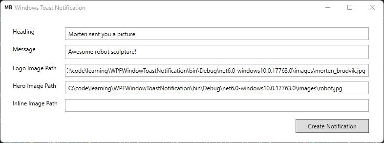
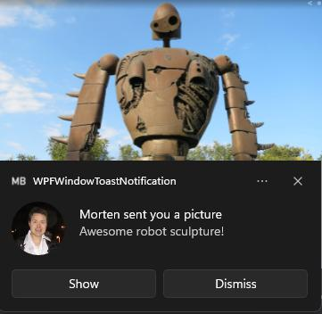

A simple example of testing and showing Windows toast notifications.



Toast notification



### How all this is done

Install nuget package
```CSharp
Microsoft.Toolkit.Uwp.Notifications
```

Specify window version in project file to enable Windows notifications
```XML
<TargetFramework>net6.0-windows10.0.17763.0</TargetFramework>
```

Create and show a toast message
```CSharp
var toastBuilder = new ToastContentBuilder()  
	.AddArgument("action", "general")  
	.AddArgument("actionId", 344)  
	.AddText("You got a mail!")  
	.AddText("You won the lottery!");  
      
toastBuilder.Show();
```

Handle toast actions
```CSharp
ToastNotificationManagerCompat.OnActivated += toastArgs =>  
{  
	ToastArguments args = ToastArguments.Parse(toastArgs.Argument);  

	Application.Current.Dispatcher.Invoke(delegate  
	{  
		 MessageBox.Show("Toast activated. Args: " + args);  
	});  
};  

```

Cleaning up messages
```CSharp
ToastNotificationManagerCompat.Uninstall();
```


For more info about the Toast API, check out:  [Toast UX Guidance - Windows apps | Microsoft Docs](https://docs.microsoft.com/en-us/windows/apps/design/shell/tiles-and-notifications/toast-ux-guidance)